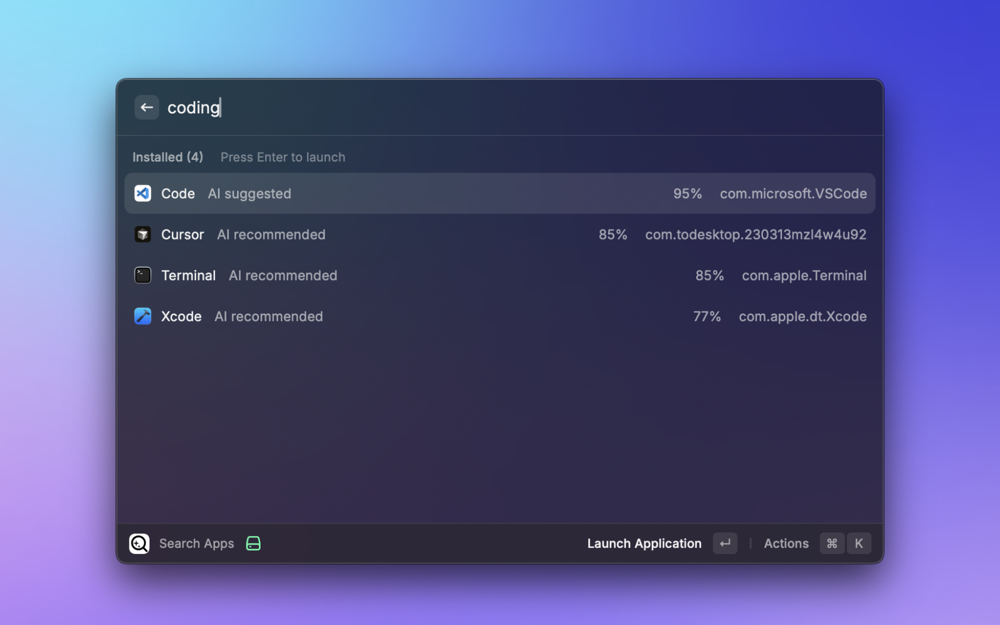

<p align="center">
  
  <h1 align="center">App Search</h1>
</p>

Find and launch installed applications using AI-powered natural language search.



## Features

- 🤖 **AI-Powered Search** - Type naturally in any language: "mail app", "browser", "画像編集"
- 🔍 **Smart Fuzzy Matching** - Find apps with partial names or acronyms (e.g., "vsc" → Visual Studio Code)
- 🌐 **Multilingual** - Full support for English and Japanese (more languages coming soon)
- ⚡ **Instant Launch** - Press Enter to open apps immediately
- 💡 **Smart Suggestions** - Get recommendations based on your search intent

## Usage

1. Open Raycast and type `Search Apps`
2. Type what you're looking for:
   - App name: `chrome`, `vscode`, `slack`
   - Purpose: `email app`, `code editor`, `browser`
   - Natural language: `app for editing photos`
   - Any language: `メール`, `ブラウザ`, `画像編集`
3. Press **Enter** to launch the app

### Pro Tips

- **Short queries** (≤3 chars): Use fuzzy matching, then select "Ask AI" for better results
- **Long queries** (4+ chars): AI automatically helps find apps by purpose
- **No results?**: The "Ask AI" option appears automatically

## Examples

```
"mail"           → Mail, Thunderbird, Spark
"vsc"            → Visual Studio Code
"browser"        → Chrome, Safari, Firefox
"recording"      → QuickTime Player, Screen Studio
"画像編集"        → Photoshop, Preview, Pixelmator
"メール書くアプリ" → Mail, Thunderbird
```

## Configuration

Change the UI language in Raycast preferences:
1. Open Raycast preferences (`⌘,`)
2. Go to Extensions → App Search
3. Select your language (English or Japanese)

## Development

```bash
npm install    # Install dependencies
npm run dev    # Development mode
npm test       # Run tests
npm run lint   # Check code quality
```

For adding new languages, see [i18n Guide](docs/i18n.md).

## License

MIT
